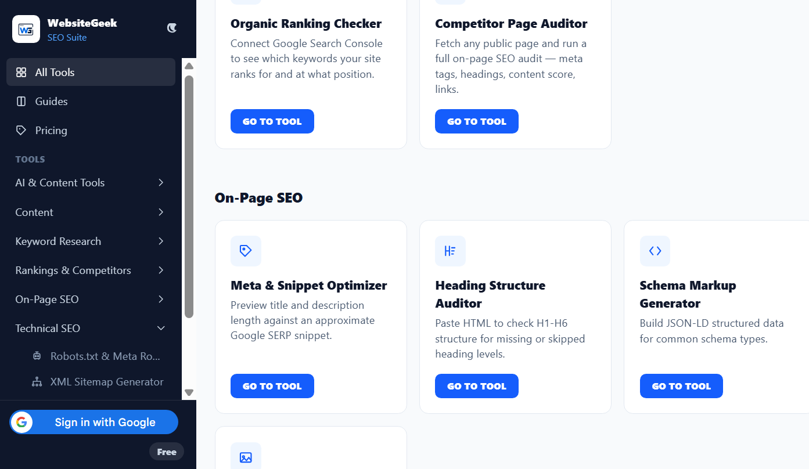

# WebsiteGeek SEO Suite

A collection of 18 client-side SEO tools — keyword research, on-page audits, technical SEO, AI content analysis, and real Google Search Console ranking data — built as a single-page React app. No signup required for the free tools, and nothing you paste is ever sent to a server; everything runs directly in your browser.

**🔗 Live demo: [websitegeek.net/seo-tools](https://websitegeek.net/seo-tools/)**

Built and maintained by [WebsiteGeek](https://websitegeek.net/) — for more free tools, guides, and reviews, visit [websitegeek.net](https://websitegeek.net/).

## Screenshots



*(More screenshots welcome — in the meantime, the [live demo](https://websitegeek.net/seo-tools/) is the best way to see it in action.)*

## Features

### 🧰 18 tools across 6 categories

- **AI & Content Tools** — AI Content Detector (heuristic), SEO Content Score
- **Content** — Character Counter, Word Counter, Line Counter, Case Converter
- **Keyword Research** — Keyword Density Checker, LSI Term Extractor
- **Rankings & Competitors** — Organic Ranking Checker (via your own Google Search Console), Competitor Page Auditor
- **On-Page SEO** — Meta & Snippet Optimizer, Heading Structure Auditor, Schema Markup Generator, Open Graph/Twitter Card Previewer
- **Technical SEO** — Robots.txt & Meta Robots Generator (with per-bot access control for search engines, AI crawlers, SEO tools, and social bots), XML Sitemap Generator, Redirect & .htaccess Rule Builder, Core Web Vitals Estimator
- **Links** — Internal Link & Anchor Text Matrix Analyzer, Broken Link & Anchor Health Checker

### 🔓 Freemium, honestly gated

Free tools work with no signup. Where a tool has a Pro tier, the free version always shows real, unblurred output up to a limit (e.g. top 5 rows) — locked content is genuinely computed and shown blurred behind an upgrade prompt, never faked or hidden outright.

### 🔐 Real Google Sign-In

Uses Google Identity Services for sign-in, and a separate OAuth flow to optionally connect Google Search Console for the Organic Ranking Checker — read-only, and only for domains you've personally verified.

### 🌗 Dark mode

A user-toggled light/dark theme (not just OS-driven), persisted across visits.

### 📚 10 in-depth SEO guides

Companion long-form guides under `/guides` covering keyword density, meta descriptions, schema markup, robots.txt, XML sitemaps, internal linking, Core Web Vitals, Open Graph tags, and a full site audit checklist.

## Tech stack

- [React 18](https://react.dev/) + [Vite 5](https://vitejs.dev/)
- [Tailwind CSS 4](https://tailwindcss.com/)
- [React Router](https://reactrouter.com/) (`HashRouter`, for static-hosting compatibility)
- Deployed as a static build to shared cPanel hosting

## Installation

This repository contains the **frontend application only** — a static, client-side SPA with no backend required to run the free tools locally.

```bash
git clone https://github.com/BJ8336/websitegeek-seo-suite-tools.git
cd websitegeek-seo-suite-tools
npm install
npm run dev
```

The dev server runs at `http://localhost:5173/seo-tools/` (note the `/seo-tools/` base path — this app is configured to deploy under a subfolder, matching the [live site](https://websitegeek.net/seo-tools/)).

To build for production:

```bash
npm run build
```

Output goes to `dist/`, ready to serve from any static host.

### Pro tier / payments

The live site's Pro tier (one-time purchase, unlocked via Google Sign-In + Stripe) depends on a separate backend service that isn't part of this repository. Running this repo locally gives you the full free-tier experience; Pro-gated sections will show the upgrade prompt since no payment backend is connected. Sign-in itself will work if you configure your own Google OAuth Client ID (see `src/context/AuthContext.jsx`) and update the authorized origins in your Google Cloud Console project.

## Project structure

```
src/
  components/   Shared UI (Sidebar, ToolHeader, LockedOverlay, ThemeToggle, ...)
  context/      React context (auth, subscription/tier, theme, toasts, upgrade modal)
  data/         Tool + guide metadata (toolsConfig.js, guidesConfig.js)
  hooks/        Small reusable hooks (debounce, document head, Google API token)
  lib/          Pure, framework-free functions the tools are built on
                (keyword density, heading audit, schema generation, robots.txt
                generation, readability scoring, link analysis, ...)
  pages/        Route-level pages (Home, Pricing, Account, guide pages)
  tools/        One folder per tool, pairing a component with its `lib/` logic
```

Most of the actual SEO logic lives in `src/lib/` as small, pure, well-tested-by-construction functions — each tool component is mostly UI wiring on top of that.

## License

MIT — see [LICENSE](LICENSE).
